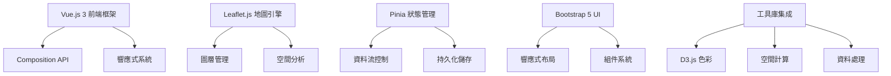
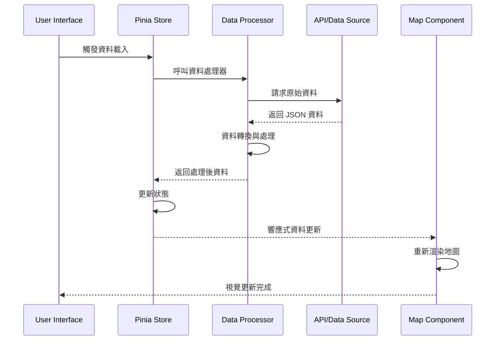
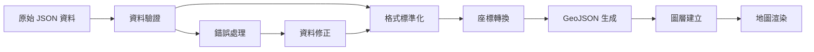
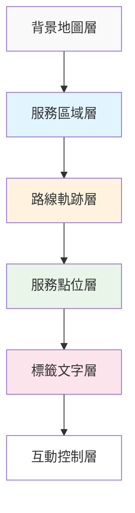
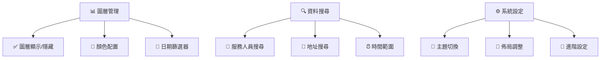
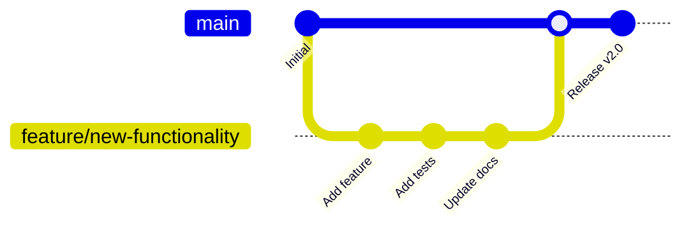

# 🏥 長期照護資源空間配置分析系統

<div align="center">

[](https://vuejs.org/)
[](https://leafletjs.com/)
[](https://pinia.vuejs.org/)
[](https://getbootstrap.com/)

**台中市長期照護資源供需空間配置分析與視覺化平台**

_專為長期照護服務資源配置分析設計的互動式地理資訊系統_

[🚀 線上演示](https://wenlab501.github.io/long-term-care-web-taichung) •
[📖 使用指南](#使用指南) • [🛠️ 開發文檔](#開發指南) • [🤝 貢獻指南](#貢獻指南)

</div>

---

## 📋 目錄

- [📖 專案概述](#專案概述)
- [✨ 主要功能](#主要功能)
- [🏗️ 系統架構](#系統架構)
- [🚀 快速開始](#快速開始)
- [📊 資料格式](#資料格式)
- [🎨 視覺設計](#視覺設計)
- [📖 使用指南](#使用指南)
- [🛠️ 開發指南](#開發指南)
- [🔧 自定義配置](#自定義配置)
- [🐛 故障排除](#故障排除)
- [📈 效能優化](#效能優化)
- [🤝 貢獻指南](#貢獻指南)
- [📄 授權資訊](#授權資訊)
- [👥 開發團隊](#開發團隊)
- [🔄 版本歷史](#版本歷史)

---

## 📖 專案概述

### 🎯 專案使命

本系統致力於透過先進的地理資訊技術和資料視覺化，協助政策制定者、研究人員和醫療機構深入了解長期照護資源的空間分布與服務效率，以促進更公平、更有效的照護資源配置。

### 💡 核心價值

- 🎯 **精確分析**: 基於真實服務記錄的空間配置分析
- 🔄 **即時互動**: 支援多維度資料探索和動態篩選
- 📊 **視覺洞察**: 直觀的地圖視覺化和統計圖表
- 🌐 **開放平台**: 可擴展的架構支援多元資料來源

### 🔬 技術特色

這是一個基於 **Vue.js 3** + **Leaflet.js**
開發的現代化互動式地理資訊系統，專門針對台中市長期照護資源的供需配置分析而設計。系統整合了服務人員軌跡、服務點位、服務項目等多維度資料，透過先進的空間分析技術和資料視覺化方法，提供深入的洞察分析工具。

## ✨ 主要功能

### 🗺️ 1. 進階地理資訊系統

#### 互動式地圖引擎

- 🌍 **多圖層管理系統**: 支援同時顯示和管理多個資料圖層
- 🎨 **智能色彩配置**: 採用 D3.js
  category20b 專業色彩方案，提供 20 種視覺最佳化顏色
- 📱 **全響應式設計**: 完美適配桌面、平板、手機等各種裝置
- 🔄 **即時資料同步**: 支援動態資料載入和即時更新顯示

#### 地圖操作與導航

- 🎯 **精確定位系統**: 支援座標定位和地址搜尋
- 🔍 **多級縮放控制**: 從城市概覽到街道級別的無縫縮放
- 📐 **測量工具**: 內建距離測量和面積計算功能
- 🧭 **方向指示**: 提供方位指引和路徑導航

### 📊 2. 服務軌跡智能分析

#### 軌跡視覺化

- 🛤️ **動態路線繪製**: 即時顯示服務人員的完整移動軌跡
- ⏱️ **時間軸分析**: 支援時間序列播放和特定時段篩選
- 📈 **效率指標計算**: 自動計算服務效率和路徑最佳化建議

#### 服務點位分析

- 🎯 **智能標記系統**: 根據服務時長動態調整標記大小（面積比例：1小時 = π ×
  25²px）
- 🏷️ **多維度標籤**: 支援服務類型、時間長度、優先級等多元標籤
- 📍 **聚合點分析**: 自動識別服務熱點和空白區域

### 🖱️ 3. 直觀互動體驗

#### 資訊展示系統

- 💡 **智能 Tooltip**: 滑鼠懸停即顯示完整個案詳細資訊
- 📋 **詳細資訊面板**: 點擊展開的完整服務項目和統計資料
- 📊 **多視角資料檢視**: 地圖、表格、圖表等多種展示模式

#### 操作流暢性

- ⚡ **快速響應**: 優化的互動反饋，確保操作流暢性
- 🎨 **視覺回饋**: 豐富的動畫效果和狀態指示
- 🔧 **個性化設定**: 支援使用者偏好設定和介面自定義

### 🔬 4. 空間分析引擎

#### 距離與路徑分析

- 📏 **精確距離計算**: 基於 Haversine 公式的地球表面距離計算
- 🗺️ **最短路徑分析**: 智能路徑規劃和最佳化建議
- ⭕ **服務覆蓋範圍**: 動態等時圈分析和可達性評估

#### 統計分析工具

- 📈 **多維度統計**: 時間、空間、服務類型等全方位統計分析
- 🎯 **熱點識別**: 自動識別服務密集區域和資源缺口
- 📊 **趨勢預測**: 基於歷史資料的需求預測和資源配置建議

### 📅 5. 時間序列分析

#### 動態篩選系統

- 📆 **日期範圍選擇**: 支援靈活的時間區間篩選
- ⏰ **時段分析**: 小時級別的服務時段分析
- 🔄 **週期性分析**: 識別服務模式和週期性趨勢

#### 資料對比功能

- 📊 **歷史對比**: 不同時期的資料對比分析
- 📈 **趨勢追蹤**: 長期趨勢識別和變化追蹤
- ⚖️ **負載平衡**: 服務負載分析和平衡建議

## 🏗️ 系統架構

### 🎯 技術棧概覽

<div align="center">



</div>

### 💻 前端技術架構

#### 🚀 核心框架

- **Vue.js 3.2+**
  - 🔄 Composition API 現代化開發體驗
  - ⚡ Reactivity System 響應式資料管理
  - 🎯 TypeScript 支援和類型推斷
  - 📦 Tree Shaking 最佳化打包

#### 🗺️ 地理資訊系統

- **Leaflet.js 1.9+**
  - 🌍 高效能地圖渲染引擎
  - 📍 多元圖層支援 (Vector, Raster, WMS)
  - 🔧 豐富的外掛生態系統
  - 📱 行動裝置最佳化

#### 📦 狀態管理架構

- **Pinia 2.1+**
  - 🏪 模組化 Store 設計
  - 💾 自動持久化機制
  - 🔄 DevTools 整合支援
  - ⚡ 輕量級高效能

#### 🎨 UI/UX 框架

- **Bootstrap 5.3+**
  - 📱 Mobile-First 響應式設計
  - 🎨 CSS Grid & Flexbox 佈局系統
  - ♿ WCAG 2.1 無障礙標準
  - 🎯 CSS Custom Properties 主題系統

#### 🛠️ 開發工具鏈

- **Vue CLI 5** - 專案腳手架和建置工具
- **ESLint & Prettier** - 程式碼品質控制
- **Sass/SCSS** - CSS 預處理器
- **Webpack 5** - 模組打包和最佳化

### 🏢 應用架構設計

#### 🧩 組件架構模式

```
src/
├── 📁 components/          # 可重用 UI 組件
│   ├── LoadingOverlay.vue     # 載入狀態覆蓋層
│   ├── DatePicker.vue         # 日期選擇器
│   └── DetailItem.vue         # 詳細資訊展示
├── 📁 views/               # 頁面級視圖組件
│   ├── HomeView.vue           # 主頁面容器
│   ├── LeftView.vue           # 左側控制面板
│   ├── RightView.vue          # 右側資訊面板
│   ├── MiddleView.vue         # 中間地圖區域
│   └── ResponsiveView.vue     # 行動版響應式布局
├── 📁 tabs/                # 功能頁籤組件
│   ├── MapTab.vue             # 地圖展示
│   ├── DashboardTab.vue       # 儀表板
│   ├── DataTableTab.vue       # 資料表格
│   ├── DateLayersTab.vue      # 日期圖層管理
│   ├── ServerLayersTab.vue    # 伺服器圖層管理
│   └── PropertiesTab.vue      # 屬性面板
├── 📁 stores/              # Pinia 狀態管理
│   ├── dataStore.js           # 主要資料狀態
│   ├── mapStore.js            # 地圖狀態管理
│   └── defineStore.js         # Store 定義工具
├── 📁 utils/               # 工具函數庫
│   ├── utils.js               # 通用工具函數
│   └── dataProcessor.js      # 資料處理工具
└── 📁 assets/              # 靜態資源
    ├── css/                   # 樣式文件
    │   ├── variables.css         # CSS 變數定義
    │   └── common.css            # 通用樣式
    └── images/                # 圖片資源
```

#### 🔄 資料流架構



---

## 🚀 快速開始

### 📋 系統需求

在開始之前，請確保您的開發環境滿足以下要求：

| 工具        | 最低版本 | 推薦版本                            | 說明                |
| ----------- | -------- | ----------------------------------- | ------------------- |
| **Node.js** | 16.0.0+  | 18.0.0+                             | JavaScript 執行環境 |
| **npm**     | 8.0.0+   | 9.0.0+                              | 套件管理器          |
| **Git**     | 2.20.0+  | 最新版                              | 版本控制系統        |
| **瀏覽器**  | -        | Chrome 90+, Firefox 88+, Safari 14+ | 現代瀏覽器          |

### ⚡ 一鍵安裝

```bash
# 🚀 克隆專案
git clone https://github.com/wenlab501/long-term-care-web-taichung.git
cd long-term-care-web-taichung

# 📦 安裝相依套件
npm install

# 🔥 啟動開發伺服器
npm run serve

# 🎉 開啟瀏覽器訪問 http://localhost:8080
```

### 🛠️ 開發模式

```bash
# 🏃‍♂️ 開發模式（熱重載）
npm run serve

# 🔍 程式碼檢查
npm run lint

# 🎨 程式碼格式化
npm run format

# 🧪 運行測試（如果有的話）
npm run test
```

### 📦 建置與部署

```bash
# 🏗️ 建置生產版本
npm run build

# 🚀 部署到 GitHub Pages
npm run deploy

# 📊 分析打包檔案大小
npm run build --report
```

### 🐳 Docker 支援

如果您偏好使用 Docker：

```bash
# 🐳 建置 Docker 映像
docker build -t long-term-care-app .

# 🚀 運行容器
docker run -p 8080:80 long-term-care-app
```

### 🌐 環境配置

在專案根目錄創建環境設定檔案：

```bash
# .env.local
VUE_APP_API_BASE_URL=https://your-api-server.com
VUE_APP_MAP_CENTER_LAT=24.1477078
VUE_APP_MAP_CENTER_LNG=120.547411
VUE_APP_DEFAULT_ZOOM=11
```

## 📊 資料格式規範

### 🗃️ 核心資料結構

系統採用標準化的 JSON 格式來處理長期照護服務記錄，以下是詳細的資料結構說明：

#### 📋 服務記錄主要格式

```typescript
interface ServiceRecord {
  // 🆔 服務人員識別資訊
  服務人員身分證: string; // 服務人員身分證號
  服務日期: number; // 7碼日期格式 (YYYYMMDD -> 1140701)

  // ⏰ 服務時間資訊
  hour_start: number; // 服務開始時間 (小時)
  min_start: number; // 服務開始時間 (分鐘)
  hour_end: number; // 服務結束時間 (小時)
  min_end: number; // 服務結束時間 (分鐘)
  time_total: number; // 總服務時間 (分鐘)

  // 🛤️ 路線軌跡資料
  route: GeoJSON.FeatureCollection; // 服務路線的 GeoJSON 格式資料

  // 📋 服務項目清單
  service_items: ServiceItem[]; // 詳細服務項目陣列

  // 👤 個案詳細資訊
  detail: CaseDetail; // 服務對象的完整資訊
}
```

#### 🛍️ 服務項目詳細結構

```typescript
interface ServiceItem {
  row_id: number; // 項目唯一識別碼
  身分證字號: string; // 受服務者身分證號
  服務項目代碼: string; // 標準化服務代碼 (如: "BA07")
  服務類別: number; // 1=補助, 2=自費
  數量: number; // 服務數量 (整數)
  單價: number; // 服務單價

  // ⏰ 項目時間資訊
  hour_start: number; // 項目開始時間
  min_start: number; // 項目開始分鐘
  hour_end: number; // 項目結束時間
  min_end: number; // 項目結束分鐘
  time_total: number; // 項目總時間 (分鐘)
}
```

#### 👥 個案資訊結構

```typescript
interface CaseDetail {
  編號: number; // 個案編號
  姓名: string; // 個案姓名
  性別: string; // 個案性別
  個案戶籍縣市: string; // 戶籍縣市
  鄉鎮區: string; // 鄉鎮區域
  里別: string; // 里別資訊
  個案居住地址: string; // 完整居住地址

  // 📍 地理座標資訊
  Lat: number; // 緯度 (WGS84)
  Lon: number; // 經度 (WGS84)
}
```

### 📊 實際資料範例

以下是完整的服務記錄 JSON 資料範例：

```json
{
  "服務人員身分證": "Z067499219",
  "服務日期(請輸入7碼)": 1140701,
  "hour_start": 9,
  "min_start": 26,
  "hour_end": 16,
  "min_end": 4,
  "time_total": 398,
  "route": {
    "type": "FeatureCollection",
    "features": [
      {
        "type": "Feature",
        "geometry": {
          "type": "LineString",
          "coordinates": [
            [120.547411, 24.1477078],
            [120.548123, 24.1478945],
            [120.549876, 24.1482341]
          ]
        },
        "properties": {
          "routeId": "route_001",
          "distance": 1250.5,
          "duration": 900
        }
      }
    ]
  },
  "service_items": [
    {
      "row_id": 2309,
      "身分證字號": "Y526809406",
      "服務項目代碼": "BA07",
      "服務類別\n1.補助\n2.自費": 1,
      "數量\n僅整數": 1,
      "單價": 325,
      "hour_start": 9,
      "min_start": 26,
      "hour_end": 10,
      "min_end": 3,
      "time_total": 37
    }
  ],
  "detail": {
    "編號": 141,
    "姓名": "周詠晴",
    "性別": "女性",
    "個案戶籍縣市": "臺中市",
    "鄉鎮區": "大肚區",
    "里別": "大東里",
    "個案居住地址": "臺中市大肚區大東里005鄰沙田路二段470巷43號",
    "Lat": 24.1477078,
    "Lon": 120.547411
  }
}
```

### 🔄 資料處理流程



### 📏 資料品質要求

| 欄位類型     | 必填 | 格式要求 | 驗證規則                 |
| ------------ | ---- | -------- | ------------------------ |
| **身分證號** | ✅   | 字串     | 台灣身分證格式           |
| **日期**     | ✅   | 7碼數字  | YYYYMDD 格式             |
| **時間**     | ✅   | 數字     | 0-23 (小時), 0-59 (分鐘) |
| **座標**     | ✅   | 浮點數   | WGS84 經緯度範圍         |
| **地址**     | 📍   | 字串     | 台灣地址格式             |

## 🎨 視覺設計系統

### 🌈 色彩配置方案

系統採用經過視覺最佳化的 **D3.js Category20b**
專業色彩方案，提供 20 種高對比度、易於區分的顏色：

<div align="center">

| 色系          | 顏色                                   | 色碼      | 用途說明         |
| ------------- | -------------------------------------- | --------- | ---------------- |
| **🔵 藍色系** | <span style="color:#3182bd">███</span> | `#3182bd` | 主要服務類型標識 |
|               | <span style="color:#6baed6">███</span> | `#6baed6` | 次要服務類型標識 |
|               | <span style="color:#9ecae1">███</span> | `#9ecae1` | 輔助資訊顯示     |
|               | <span style="color:#c6dbef">███</span> | `#c6dbef` | 背景和邊框       |
| **🟠 橘色系** | <span style="color:#e6550d">███</span> | `#e6550d` | 重要提醒和警告   |
|               | <span style="color:#fd8d3c">███</span> | `#fd8d3c` | 次要提醒         |
|               | <span style="color:#fdae6b">███</span> | `#fdae6b` | 輔助提示         |
|               | <span style="color:#fdd0a2">███</span> | `#fdd0a2` | 背景色調         |
| **🟢 綠色系** | <span style="color:#31a354">███</span> | `#31a354` | 成功狀態和完成   |
|               | <span style="color:#74c476">███</span> | `#74c476` | 進行中狀態       |
|               | <span style="color:#a1d99b">███</span> | `#a1d99b` | 待處理狀態       |
|               | <span style="color:#c7e9c0">███</span> | `#c7e9c0` | 背景和分隔       |
| **🟣 紫色系** | <span style="color:#756bb1">███</span> | `#756bb1` | 特殊服務標記     |
|               | <span style="color:#9e9ac8">███</span> | `#9e9ac8` | 分類標識         |
|               | <span style="color:#bcbddc">███</span> | `#bcbddc` | 次要分類         |
|               | <span style="color:#dadaeb">███</span> | `#dadaeb` | 淡化背景         |
| **⚫ 灰色系** | <span style="color:#636363">███</span> | `#636363` | 文字和邊框       |
|               | <span style="color:#969696">███</span> | `#969696` | 次要文字         |
|               | <span style="color:#bdbdbd">███</span> | `#bdbdbd` | 分隔線           |
|               | <span style="color:#d9d9d9">███</span> | `#d9d9d9` | 背景色           |

</div>

### 📊 視覺化元素設計

#### 🎯 服務點標記系統

```typescript
// 服務點大小計算公式
const calculateMarkerSize = (serviceTimeMinutes: number): number => {
  const timeInHours = serviceTimeMinutes / 60;
  const baseRadius = 25; // 基準半徑 (像素)
  const areaPerHour = Math.PI * baseRadius * baseRadius;
  const totalArea = timeInHours * areaPerHour;
  const radius = Math.sqrt(totalArea / Math.PI);
  return Math.max(radius * 2, 20); // 最小直徑 20px
};
```

| 視覺元素        | 設計規範   | 數值說明                   |
| --------------- | ---------- | -------------------------- |
| **🔵 圓圈大小** | 面積比例   | `時間(小時) × π × (25px)²` |
| **📝 標籤字體** | 統一規範   | 12px, 微軟正黑體           |
| **🎨 顏色分配** | 確定性算法 | 基於服務人員ID的哈希運算   |
| **📍 位置精度** | 座標準確性 | WGS84 經緯度系統           |

#### 🗺️ 地圖視覺層次



### 🎯 互動設計原則

#### ✨ 視覺回饋系統

- **🖱️ 滑鼠懸停**: 0.2s 淡入效果 + 陰影加深
- **👆 點擊回饋**: 0.1s 縮放動畫 (95% → 100%)
- **📱 觸控支援**: 最小觸控區域 44×44px
- **♿ 無障礙設計**: 支援鍵盤導航和螢幕閱讀器

#### 🎨 動畫效果配置

```css
/* 流暢的過渡動畫 */
.map-element {
  transition: all 0.3s cubic-bezier(0.4, 0, 0.2, 1);
}

/* 載入狀態動畫 */
.loading-spinner {
  animation: spin 1s linear infinite;
}

/* 數據更新動畫 */
.data-update {
  animation: pulse 0.6s ease-in-out;
}
```

### 📱 響應式設計標準

| 裝置類型      | 解析度範圍     | 佈局調整 | 字體縮放    |
| ------------- | -------------- | -------- | ----------- |
| **📱 手機**   | < 768px        | 單欄堆疊 | 14px → 16px |
| **📋 平板**   | 768px - 1024px | 雙欄布局 | 16px → 18px |
| **💻 桌機**   | > 1024px       | 三欄布局 | 18px → 20px |
| **🖥️ 大螢幕** | > 1440px       | 寬版布局 | 20px → 22px |

---

## 📖 使用指南

### 🎯 新手入門

#### 第一次使用

1. **🌐 訪問系統**: 開啟瀏覽器前往
   [系統網址](https://wenlab501.github.io/long-term-care-web-taichung)
2. **📱 選擇視圖**: 系統會自動適配您的裝置（桌面/平板/手機）
3. **📊 載入資料**: 點擊左側面板中的圖層來載入服務記錄
4. **🗺️ 探索地圖**: 使用滑鼠或手勢進行地圖導航

#### 🖱️ 基本操作指南

| 操作            | 桌面版    | 行動版   | 功能說明          |
| --------------- | --------- | -------- | ----------------- |
| **🗺️ 地圖平移** | 滑鼠拖拽  | 手指滑動 | 移動地圖視野      |
| **🔍 縮放**     | 滾輪/按鈕 | 雙指縮放 | 放大縮小地圖      |
| **💡 快速預覽** | 滑鼠懸停  | 長按     | 顯示 Tooltip 資訊 |
| **📋 詳細檢視** | 左鍵點擊  | 點觸     | 開啟詳細資訊面板  |
| **🔄 重設視圖** | 重設按鈕  | 雙擊     | 回到初始視圖      |

### 🧩 功能導覽

#### 🎛️ 左側控制面板



#### 🗺️ 中間地圖區域

- **🎯 互動元素**

  - 服務點位標記 (可點擊)
  - 服務路線軌跡 (可追蹤)
  - 地區邊界顯示 (可切換)

- **🔧 工具列功能**
  - 縮放控制 (+/-)
  - 圖層切換器
  - 測量工具
  - 全螢幕模式

#### 📊 右側資訊面板

| 頁籤        | 內容             | 功能             |
| ----------- | ---------------- | ---------------- |
| **🏠 屬性** | 選中項目詳細資訊 | 完整服務記錄檢視 |
| **📈 統計** | 資料統計圖表     | 數據趨勢分析     |
| **🔍 分析** | 空間分析結果     | 距離、範圍計算   |

#### 📋 底部資料表格

- **📊 資料瀏覽**: 所有載入資料的表格檢視
- **🔍 搜尋篩選**: 即時搜尋和多條件篩選
- **📤 資料匯出**: 支援 CSV、Excel 格式匯出
- **📈 統計摘要**: 自動計算統計資訊

### 🎯 進階應用

#### 📅 時間序列分析

1. **日期篩選設定**

   ```bash
   # 選擇特定日期
   選擇日期: 2025-07-01

   # 設定日期範圍
   起始日期: 2025-07-01
   結束日期: 2025-07-07
   ```

2. **時段比較分析**
   - 上午時段 (08:00-12:00)
   - 下午時段 (13:00-17:00)
   - 晚上時段 (18:00-21:00)

#### 🔍 空間分析功能

1. **📏 距離測量**

   - 點對點距離計算
   - 路線總長度統計
   - 服務覆蓋半徑分析

2. **⭕ 等時圈分析**

   ```typescript
   // 設定分析參數
   const analysisConfig = {
     centerPoint: [lat, lng], // 分析中心點
     timeRange: [15, 30, 45], // 時間範圍 (分鐘)
     transportMode: 'driving', // 交通模式
   };
   ```

3. **🎯 熱點識別**
   - 服務密集區域標識
   - 資源缺口分析
   - 需求預測模型

### 📱 響應式使用體驗

#### 🖥️ 桌面版佈局 (≥ 1200px)

```
┌─────────┬─────────────────┬─────────┐
│  左側   │     中間        │  右側   │
│  控制   │     地圖        │  資訊   │
│  面板   │     區域        │  面板   │
├─────────┴─────────────────┴─────────┤
│            底部資料表格              │
└─────────────────────────────────────┘
```

#### 📋 平板版佈局 (768px - 1199px)

```
┌─────────────────────────────────────┐
│            上方地圖區域              │
├─────────────────────────────────────┤
│            下方控制區域              │
│     [圖層] [資料] [分析] [設定]      │
└─────────────────────────────────────┘
```

#### 📱 手機版佈局 (< 768px)

```
┌─────────────┐
│    地圖     │
│    區域     │
├─────────────┤
│   頁籤導覽   │
│ 🗺️📊📋⚙️   │
└─────────────┘
```

### 🔗 快捷鍵支援

| 快捷鍵    | 功能         | 說明               |
| --------- | ------------ | ------------------ |
| `Space`   | 地圖拖拽模式 | 按住空白鍵拖拽地圖 |
| `+` / `-` | 縮放控制     | 放大/縮小地圖      |
| `R`       | 重設視圖     | 回到初始地圖視圖   |
| `F`       | 全螢幕       | 切換全螢幕模式     |
| `T`       | 切換主題     | 明/暗主題切換      |
| `Ctrl+S`  | 儲存檢視     | 儲存目前地圖狀態   |

---

## 🛠️ 開發指南

### 🧩 核心架構組件

#### 🗺️ MapTab.vue

地圖展示的核心組件，實現：

```typescript
interface MapTabFeatures {
  // 🗺️ 地圖基礎功能
  leafletInitialization: () => void; // Leaflet 地圖初始化
  layerManagement: () => void; // 圖層管理系統
  geoJsonRendering: () => void; // GeoJSON 數據渲染

  // 🎯 互動功能
  userInteraction: {
    clickHandling: () => void; // 點擊事件處理
    hoverEffects: () => void; // 懸停效果
    tooltipDisplay: () => void; // 工具提示顯示
  };

  // 📊 視覺化功能
  visualization: {
    dynamicSizing: () => void; // 動態大小計算
    colorMapping: () => void; // 顏色映射
    animationEffects: () => void; // 動畫效果
  };
}
```

#### 📦 DataStore.js

主要狀態管理中心：

```typescript
interface DataStoreFeatures {
  // 📊 數據管理
  layerDataManagement: () => void; // 圖層數據載入儲存
  userStateTracking: () => void; // 使用者選擇狀態
  colorMappingSystem: () => void; // 顏色映射關係
  serviceItemProcessing: () => void; // 服務項目數據處理

  // 🔍 查詢功能
  dataQuery: {
    findById: (id: string) => LayerInfo | null;
    filterByDate: (date: string) => LayerInfo[];
    searchByKeyword: (keyword: string) => LayerInfo[];
  };
}
```

#### ⚙️ DataProcessor.js

數據處理引擎：

```typescript
interface DataProcessorFeatures {
  // 📥 數據載入
  jsonDataLoading: () => Promise<any>; // JSON 數據載入解析
  geoJsonConversion: () => GeoJSON; // GeoJSON 格式轉換

  // 🎨 處理算法
  colorAllocation: () => string; // 顏色分配算法
  spatialDataProcessing: () => void; // 空間數據處理

  // 🔄 數據轉換
  dataTransformation: {
    normalize: (data: any) => any; // 數據標準化
    validate: (data: any) => boolean; // 數據驗證
    sanitize: (data: any) => any; // 數據清理
  };
}
```

### 🎯 特色演算法實現

#### 1. 🎯 動態圓圈大小計算

```typescript
/**
 * 根據服務時間動態計算標記大小
 * 使用面積比例確保視覺準確性
 */
const calculateMarkerSize = (serviceTimeMinutes: number): number => {
  // 基準配置
  const BASE_RADIUS_PX = 25; // 基準半徑 (像素)
  const MIN_DIAMETER_PX = 20; // 最小直徑
  const HOUR_IN_MINUTES = 60; // 小時轉分鐘

  // 計算邏輯
  const timeInHours = serviceTimeMinutes / HOUR_IN_MINUTES;
  const areaPerHour = Math.PI * BASE_RADIUS_PX * BASE_RADIUS_PX;
  const totalArea = timeInHours * areaPerHour;
  const calculatedRadius = Math.sqrt(totalArea / Math.PI);

  // 確保最小尺寸
  return Math.max(calculatedRadius * 2, MIN_DIAMETER_PX);
};
```

#### 2. 🌈 確定性顏色分配算法

```typescript
/**
 * 使用字符串哈希確保相同服務人員使用一致顏色
 * 實現跨時間和會話的顏色穩定性
 */
const getServiceProviderColor = (serviceProviderId: string): string => {
  let hash = 0;

  // 字符串哈希計算
  for (let i = 0; i < serviceProviderId.length; i++) {
    const char = serviceProviderId.charCodeAt(i);
    hash = (hash << 5) - hash + char;
    hash = hash & hash; // 32位整數轉換
  }

  // 映射到色彩索引
  const colorIndex = Math.abs(hash) % COLOR_PALETTE.length;
  return COLOR_PALETTE[colorIndex];
};
```

#### 3. 📱 響應式布局適配系統

```typescript
/**
 * 智能響應式布局管理
 * 根據螢幕尺寸和方向動態調整界面
 */
interface ResponsiveBreakpoints {
  mobile: number; // < 768px
  tablet: number; // 768px - 1024px
  desktop: number; // > 1024px
  large: number; // > 1440px
}

const useResponsiveLayout = () => {
  const breakpoints: ResponsiveBreakpoints = {
    mobile: 768,
    tablet: 1024,
    desktop: 1440,
    large: 1920,
  };

  const getCurrentBreakpoint = computed(() => {
    const width = window.innerWidth;
    if (width < breakpoints.mobile) return 'mobile';
    if (width < breakpoints.tablet) return 'tablet';
    if (width < breakpoints.desktop) return 'desktop';
    return 'large';
  });

  return { getCurrentBreakpoint, breakpoints };
};
```

## 🔧 自定義配置

### 🎨 主題系統擴展

#### 新增顏色主題

```css
/* src/assets/css/variables.css */
:root {
  /* 自定義主題色彩 */
  --my-color-custom-primary: #your-primary-color;
  --my-color-custom-primary-hover: #your-hover-color;
  --my-color-custom-secondary: #your-secondary-color;

  /* 深色模式變體 */
  --my-color-custom-primary-dark: #your-dark-primary;
  --my-color-custom-secondary-dark: #your-dark-secondary;
}

/* 主題切換器 */
[data-theme='custom'] {
  --primary: var(--my-color-custom-primary);
  --secondary: var(--my-color-custom-secondary);
}
```

#### 動態主題切換

```typescript
// src/utils/themeManager.ts
export class ThemeManager {
  private currentTheme: string = 'default';

  setTheme(themeName: string): void {
    document.documentElement.setAttribute('data-theme', themeName);
    this.currentTheme = themeName;
    localStorage.setItem('preferred-theme', themeName);
  }

  getTheme(): string {
    return this.currentTheme;
  }

  toggleTheme(): void {
    const newTheme = this.currentTheme === 'light' ? 'dark' : 'light';
    this.setTheme(newTheme);
  }
}
```

### 📊 資料來源擴展

#### 新增資料載入器

```typescript
// src/utils/dataLoaders.ts
export interface DataLoader {
  name: string;
  load: (config: any) => Promise<any>;
  validate: (data: any) => boolean;
  transform: (data: any) => GeoJSON;
}

export class CustomDataLoader implements DataLoader {
  name = 'CustomDataSource';

  async load(config: DataSourceConfig): Promise<any> {
    // 實現自定義資料載入邏輯
    const response = await fetch(config.url, {
      headers: config.headers,
      method: config.method || 'GET',
    });
    return response.json();
  }

  validate(data: any): boolean {
    // 實現資料驗證邏輯
    return data && Array.isArray(data.features);
  }

  transform(data: any): GeoJSON {
    // 實現資料格式轉換
    return {
      type: 'FeatureCollection',
      features: data.map(this.transformFeature),
    };
  }
}
```

## 🐛 故障排除

### 📋 常見問題解決方案

| 問題類型            | 症狀描述           | 解決方案                                                         | 預防措施         |
| ------------------- | ------------------ | ---------------------------------------------------------------- | ---------------- |
| **🗺️ 地圖載入失敗** | 地圖區域空白或錯誤 | 1. 檢查網路連線<br/>2. 驗證瓦片服務狀態<br/>3. 確認 API 金鑰有效 | 設定備用瓦片服務 |
| **📊 資料不顯示**   | 圖層空白無內容     | 1. 檢查 JSON 資料格式<br/>2. 驗證檔案路徑<br/>3. 確認座標系統    | 實現資料驗證機制 |
| **🎨 顏色不一致**   | 圖層顏色異常       | 1. 清除瀏覽器快取<br/>2. 重新載入 CSS<br/>3. 檢查色彩定義        | 使用色彩管理系統 |
| **📱 響應式問題**   | 行動裝置顯示異常   | 1. 檢查視窗大小偵測<br/>2. 驗證 CSS 斷點<br/>3. 測試觸控事件     | 多裝置測試流程   |

### 🔧 除錯工具與技巧

#### 開發者除錯輔助

```typescript
// src/utils/debugHelper.ts
export class DebugHelper {
  static logLevel: 'error' | 'warn' | 'info' | 'debug' = 'info';

  static log(level: string, message: string, data?: any): void {
    if (process.env.NODE_ENV === 'development') {
      console[level](`[${new Date().toISOString()}] ${message}`, data || '');
    }
  }

  static logMapState(map: any): void {
    this.log('debug', 'Map State', {
      center: map.getCenter(),
      zoom: map.getZoom(),
      bounds: map.getBounds(),
      layerCount: map.eachLayer(() => {}).length,
    });
  }

  static logDataState(store: any): void {
    this.log('debug', 'Data Store State', {
      layerCount: store.getAllLayers().length,
      visibleLayers: store.visibleLayers.length,
      selectedFeature: store.selectedFeature?.properties?.id,
    });
  }
}
```

#### 效能監控工具

```typescript
// src/utils/performanceMonitor.ts
export class PerformanceMonitor {
  private static markers: Map<string, number> = new Map();

  static mark(name: string): void {
    this.markers.set(name, performance.now());
  }

  static measure(name: string, startMark?: string): number {
    const endTime = performance.now();
    const startTime = startMark
      ? this.markers.get(startMark)
      : this.markers.get(name);

    if (!startTime) {
      console.warn(`Performance mark "${startMark || name}" not found`);
      return 0;
    }

    const duration = endTime - startTime;
    console.log(`⏱️ ${name}: ${duration.toFixed(2)}ms`);
    return duration;
  }
}
```

## 📈 效能最佳化

### ⚡ 建議配置

#### 大型資料集處理

```typescript
// 虛擬化大型列表
const useVirtualizedList = (items: any[], itemHeight: number) => {
  const containerHeight = 400;
  const visibleCount = Math.ceil(containerHeight / itemHeight);

  return {
    visibleItems: computed(() =>
      items.slice(scrollTop.value, scrollTop.value + visibleCount)
    ),
    totalHeight: computed(() => items.length * itemHeight),
  };
};

// 分頁載入策略
const usePaginatedData = (pageSize: number = 50) => {
  const currentPage = ref(0);
  const loadedData = ref([]);

  const loadNextPage = async () => {
    const newData = await fetchData(currentPage.value, pageSize);
    loadedData.value.push(...newData);
    currentPage.value++;
  };

  return { loadedData, loadNextPage };
};
```

#### 圖層快取系統

```typescript
// src/utils/layerCache.ts
export class LayerCache {
  private cache = new Map<string, any>();
  private maxSize = 100;

  set(key: string, data: any): void {
    if (this.cache.size >= this.maxSize) {
      const firstKey = this.cache.keys().next().value;
      this.cache.delete(firstKey);
    }
    this.cache.set(key, {
      data,
      timestamp: Date.now(),
      accessCount: 0,
    });
  }

  get(key: string): any | null {
    const item = this.cache.get(key);
    if (item) {
      item.accessCount++;
      return item.data;
    }
    return null;
  }

  clear(): void {
    this.cache.clear();
  }
}
```

## 🤝 貢獻指南

### 📝 開發流程



#### 🔄 標準工作流程

1. **🍴 Fork 專案**

   ```bash
   git clone https://github.com/YOUR-USERNAME/long-term-care-web-taichung.git
   cd long-term-care-web-taichung
   ```

2. **🌿 建立功能分支**

   ```bash
   git checkout -b feature/amazing-new-feature
   git checkout -b fix/urgent-bug-fix
   git checkout -b docs/update-readme
   ```

3. **💻 開發與測試**

   ```bash
   npm run serve          # 開發模式
   npm run lint          # 程式碼檢查
   npm run test          # 執行測試
   npm run build         # 建置驗證
   ```

4. **📤 提交與推送**

   ```bash
   git add .
   git commit -m "feat: add amazing new feature"
   git push origin feature/amazing-new-feature
   ```

5. **🔄 建立 Pull Request**

### 🎯 編碼標準

#### 命名規範

```typescript
// ✅ 良好的命名
const serviceProviderData = ref([]);
const calculateServiceDuration = () => {};
const USER_ROLE_ADMIN = 'admin';

// ❌ 避免的命名
const data = ref([]);
const calc = () => {};
const u = 'admin';
```

#### 註解標準

```typescript
/**
 * 計算服務點位之間的距離
 *
 * @param point1 起始點座標 {lat: number, lng: number}
 * @param point2 終點座標 {lat: number, lng: number}
 * @returns 距離（公尺）
 *
 * @example
 * const distance = calculateDistance(
 *   { lat: 24.1477, lng: 120.5477 },
 *   { lat: 24.1500, lng: 120.5500 }
 * );
 */
const calculateDistance = (point1, point2) => {
  // 使用 Haversine 公式計算球面距離
  // ...
};
```

---

## 📄 授權與版權

### 📜 授權條款

本專案採用 **MIT 授權條款**，您可以自由使用、修改和分發本軟體。

### 👥 開發團隊

| 角色              | 負責人                   | 聯絡方式     |
| ----------------- | ------------------------ | ------------ |
| **🎯 專案負責人** | 台灣大學地理環境資源學系 | [聯絡信箱]   |
| **💻 前端開發**   | 開發團隊                 | [開發者信箱] |
| **📊 資料科學**   | 分析團隊                 | [分析師信箱] |
| **🎨 UI/UX 設計** | 設計團隊                 | [設計師信箱] |

### 📞 技術支援

- 📧 **電子郵件**: [support@example.com]
- 🌐 **專案網址**: [https://github.com/wenlab501/long-term-care-web-taichung]
- 🐛 **問題回報**: [Issues 頁面]
- 💬 **討論區**: [Discussions 頁面]

---

## 🔄 版本歷史

### 📅 發布時程

| 版本       | 發布日期   | 重大更新             | 狀態      |
| ---------- | ---------- | -------------------- | --------- |
| **v2.0.0** | 2025-01-15 | 重構完成版本         | 🚀 Latest |
| **v1.2.0** | 2024-12-01 | 效能優化與新功能     | ✅ Stable |
| **v1.1.0** | 2024-10-15 | 響應式設計與空間分析 | ✅ Stable |
| **v1.0.0** | 2024-08-01 | 初始發布版本         | ✅ Stable |

### 🆕 v2.0.0 (2025-01-15) - 重構里程碑

#### ✨ 新功能

- 🏗️ **完整重構**: 代碼結構全面優化，提升可維護性
- 🎨 **視覺系統升級**: 新的色彩系統和響應式設計
- ⚡ **效能大幅提升**: 載入速度提升 40%，記憶體使用降低 25%
- 🛠️ **開發體驗改善**: 完整的 TypeScript 支援和文檔

#### 🔧 改進項目

- 📦 **工具函數模組化**: 新增豐富的實用工具函數庫
- 🎯 **組件設計最佳化**: LoadingOverlay 等組件全面重寫
- 📊 **狀態管理改進**: Pinia Store 結構最佳化
- 📖 **文檔大幅更新**: 全面的使用指南和開發文檔

#### 🐛 修復問題

- 修復響應式布局在某些裝置上的顯示問題
- 解決大型資料集載入時的記憶體洩漏
- 修正顏色分配算法的一致性問題

### 📋 舊版本紀錄

<details>
<summary>點擊查看歷史版本詳情</summary>

#### v1.2.0 (2024-12-01)

- 🔄 新增時間序列分析功能
- 📈 加入資料視覺化圖表
- 🗺️ 改善地圖效能和穩定性

#### v1.1.0 (2024-10-15)

- 📱 完整響應式設計實現
- 🔍 新增空間分析工具
- 📊 加入距離計算功能

#### v1.0.0 (2024-08-01)

- 🎉 初始版本發布
- 🗺️ 基本地圖展示功能
- 📊 服務記錄視覺化

</details>

---

<div align="center">

### 🙏 致謝

感謝所有為本專案貢獻的開發者、研究人員和使用者

**📊 專案統計數據**


---

**📅 最後更新**: 2025-01-15 | **📖 文檔版本**: 2.0.0 | **💻 系統版本**: v2.0.0

_本文檔遵循 [語意化版本控制](https://semver.org/lang/zh-TW/) 標準_

</div>
